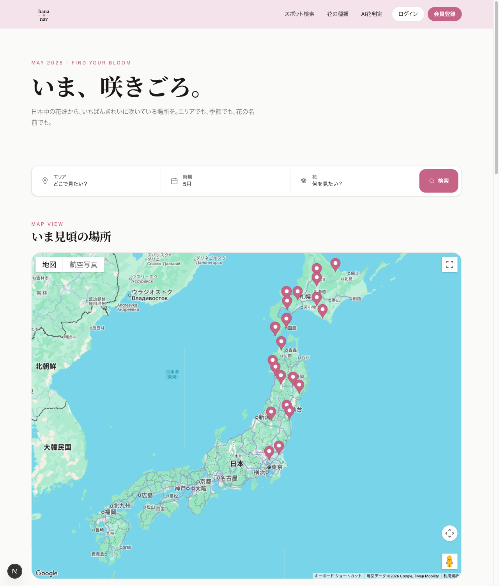
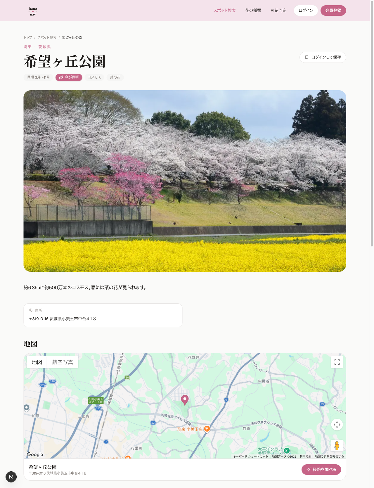
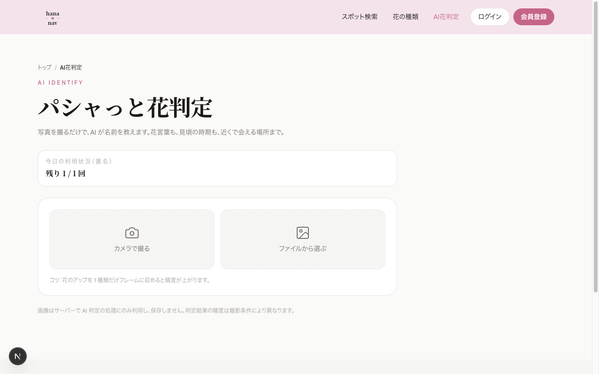

# hana nav

**「いつ・どこで・何が咲いているか」が一目でわかる、全国の花畑スポット検索サービス。**

🔗 **Live demo**: <https://hananav.site>

ログイン画面の「**ゲストログイン（閲覧専用）**」ボタンで管理画面を含めた全動線を確認できます（書き込みは UI とサーバー両層でブロック）。

> 見頃カレンダー × 地図検索 × AI 花判定 → 旅のしおり画像生成 → SNS 共有までを一通り備えた、個人開発の MVP。Next.js 16（App Router）+ React 19 + Cache Components + Supabase を本番運用ライクに組み合わせ、ユーザー導線・管理画面・データ収集パイプラインまで実装している。

<!-- スクリーンショット -->

<table>
<tr>
<td valign="top" width="33%"><b>トップ（見頃マップ + エリア + AI 訴求）</b><br></td>
<td valign="top" width="33%"><b>スポット詳細</b><br></td>
<td valign="top" width="33%"><b>AI 花判定 → 旅のしおり</b><br></td>
</tr>
</table>

---

## 技術スタック

| 領域         | 選定                                                                         | 採用理由・ポイント                                                                       |
| ------------ | ---------------------------------------------------------------------------- | ---------------------------------------------------------------------------------------- |
| フロント     | **Next.js 16.2.4 (App Router) + React 19.2.4 + TypeScript**                  | Server Components 前提のキャッシュ戦略を素直に書くため最新メジャーを採用                 |
| キャッシュ   | **Next.js Cache Components**（`'use cache'` + `cacheTag` + `updateTag`）     | 公開ページの read-your-own-writes をピンポイントに実現                                   |
| スタイリング | **Tailwind CSS v4**（`@theme` トークン定義）+ shadcn/ui                      | `tailwind.config` 不要の CSS-only 構成、デザイントークンと CSS 変数の境界を 1 箇所に集約 |
| DB / 認証    | **Supabase (PostgreSQL + RLS + Storage + Auth)**                             | `@supabase/ssr` ベースで Cookie 同期を厳密に運用                                         |
| AI           | **Google Gemini API (`gemini-2.5-flash`)** + マスタとの 3 段階フォールバック | 「総称（マッチング用）」と「品種名（表示用）」を分離して再現率を稼ぐ                     |
| 地図         | Google Maps JavaScript API                                                   | 月予算アラートで青天井防止                                                               |
| 画像合成     | **Canvas API**（クライアント側合成）                                         | 旅のしおりを 1 枚画像で Web Share API → SNS へ                                           |
| ホスティング | **Vercel**                                                                   | Image Optimization・Edge / Functions・Spend Management で MVP 段階の運用負荷を最小化     |
| データ収集   | Python（scrape → normalize → geocode → validate → upload の 5 段スクリプト） | 公式 URL / 出典明記を validate 段階で必須化                                              |

**想定月額コスト（MAU 5,000）**: ¥3,000〜21,800（無料枠運用 → スケールで Pro 移行）

---

## 設計上の意思決定

「なぜそう書いてあるか」を 1 文で答えられる粒度に揃え、根拠を `CLAUDE.md` と `docs/specs/` に分けて文書化している。

### 1. Server Components 前提の徹底（App Router）

- データ取得は **Server Component 内で直接 `async/await`**。`useEffect + fetch` でクライアントから取りに行かない。
- Client 境界（`'use client'`）は **末端の葉**まで押し下げる。一覧ページ全体に `'use client'` を付けない。
- Mutation は **Server Actions** を第一選択、外部から叩く REST 的なものだけ Route Handler。
- 検索フィルタなど「共有・SEO・戻るボタン」が要件になる UI 状態は **`searchParams` に持たせて Server Component で読む**。`useState` のクライアント状態にしない。
- 失敗パターンを表で明示しチームでも踏まないよう `CLAUDE.md` に「やりがちな NG パターン」として固定化。

### 2. Cache Components による read-your-own-writes

`'use cache'` + `cacheTag()` で公開ページのキャッシュキーを **エンティティ単位**で持たせ、Admin の Server Action では `updateTag()` で同期的に該当タグを破棄する。

| タグ                        | 付与箇所                     | 破棄タイミング                        |
| --------------------------- | ---------------------------- | ------------------------------------- |
| `flowers` / `flower:<id>`   | 花一覧・詳細・関連表示       | 花マスター編集 / 別名追加             |
| `spots` / `spot:<id>`       | スポット一覧・詳細・関連表示 | スポット追加 / 公開切替 / 編集        |
| `prefectures` / `area:<id>` | エリア集計・都道府県マスター | 都道府県マスター更新 / 該当地域の更新 |

`revalidateTag` ではなく `updateTag` を選んだのは、admin 編集直後の閲覧で **即時反映** を保証したかったため（`revalidateTag` は次リクエストで lazy 再検証）。タグ定数は `lib/cacheTags.ts` に集約し、文字列直書きを禁止して invalidation 漏れを防ぐ。

### 3. 多態関連（`images` テーブル）の 2 層整合性

画像テーブルは `owner_type` (`'spot' | 'flower'`) + `owner_id` で多態関連を表現するため外部キー制約がかけられない。孤立画像を防ぐために **2 層防御**:

- **A 層**: アプリ層の共通バリデータ `lib/utils/imageValidator.ts` で INSERT 前に親存在チェック
- **B 層**: DB トリガー `validate_image_owner_trigger` で同じ検証を SQL レイヤでも実施

「アプリ層だけだと別バッチや手作業の SQL から書き込まれたときに落ちる」というユースケースを潰すためにあえて二重化している。

### 4. 論理削除と RLS の罠

全テーブルに `deleted_at TIMESTAMPTZ DEFAULT NULL` を持たせ、物理削除を禁止。クエリでは `WHERE deleted_at IS NULL`（Supabase クライアントなら `.is('deleted_at', null)`）を必須にする。

**落とし穴**: RLS の SELECT ポリシーに `deleted_at IS NULL` を入れると、論理削除 UPDATE の RETURNING が更新後の行を取り戻せず "new row violates row-level security policy" になる。**SELECT ポリシーには deleted_at 条件を含めず、フィルタは必ずアプリ層で行う** ことを規約として固定。UPDATE ポリシーは `USING` と同じ式を `WITH CHECK` にも明示する。

### 5. AI 判定の信頼性とコスト

- **再現率対策**: Gemini に「総称（マッチング用 `flower_name`）」と「品種名（表示用 `cultivar`）」の両方を返させる。マッチングは `flowers.name` → `flower_aliases.alias` の順で **3 段階フォールバック**。マスター未登録時は「自信なし」を明示し関連スポットは出さない。
- **コスト爆発対策**:
  - クライアント側で **max 1024px / JPEG 0.8 / 2MB 以下**にリサイズしてから送信
  - **SHA-256 ハッシュをキーに 24 時間キャッシュ**して同一画像の重複呼び出しをゼロ化
  - レート制限は `ai_usage_logs` テーブルベース（**匿名 1 回/日、ログイン 3 回/日**）。リワード広告視聴で +5 回解放
  - Google Cloud / Vercel の月予算アラート（¥5,000）を設定し、流出時の即時無効化手順を `docs/specs/operations.md` に明記

### 6. セキュリティ境界

- `SUPABASE_SERVICE_ROLE_KEY` / `GEMINI_API_KEY` は **`NEXT_PUBLIC_` プレフィックスを付けない**。Client Component から import しない。
- Service Role を使う処理は **Route Handler または Server Action 内**に閉じ込め、RLS をバイパスする自覚を持って使う。
- `@supabase/ssr` の Cookie 同期は **`getAll()` / `setAll()` ペア**で書き、`createServerClient` と `auth.getUser()` の間に他の処理を挟まない（セッション喪失バグの典型）。
- 中間者からの判定回避のため、保護されたページでは **`getSession()` ではなく `getUser()`** を使う（Cookie は user が改ざん可能で検証されない）。

### 7. オーバーツーリズム・私有地侵入への配慮

技術以外の観点も MVP の段階から織り込んでいる。

| 制約                     | 実装                                                                           |
| ------------------------ | ------------------------------------------------------------------------------ |
| 出典の明示を必須化       | `official_url` が NULL の場合は `source` 必須（validate スクリプトでチェック） |
| 公開前の人手レビュー     | スポットは `is_published=false` で投入 → 管理者が確認 → 公開                   |
| 位置情報の意図的なボカし | ピンは公式駐車場 / 入口に統一（私有地の特定を防ぐ）                            |
| 「秘境」訴求の排除       | UI コピーで「誰も知らない」「穴場」を使わない                                  |
| マナー啓発               | スポット詳細ページに「ゴミを持ち帰ろう」「花は摘まない」を明記                 |

### 8. タイムゾーン（JST 強制）

Vercel Functions は `TZ` が予約環境変数で UTC 固定。`new Date()` をそのまま使うと本番で日付がズレる。`lib/utils/dateUtils.ts` のヘルパー（`tokyoMonth()` / `tokyoYmd()` / `tokyoTodayStartIso()` / `tokyoMonthStartIso()`）を必ず経由するルールにし、SSR と Client の境界を跨ぐ日付値は Server で JST 化してから props で渡す。

### 9. 閲覧専用ロールの 2 層防御

外部の方が管理画面の UI を確認できるよう、書き込みを一切できない「ゲスト管理者」アカウントを用意している。DB スキーマには手を入れず、`lib/auth/guestAdmin.ts` の定数とユーザー email を一致比較するだけで識別する。

- **層 1（サーバー）**: 書き込み系の Server Action は `requireWriteAdmin()` で `GuestModeError` を throw、Route Handler は `requireWriteAdminOrResponse()` で 403 / `{ "error": "guest_read_only" }` を返す。**この層が真の防御**で、cURL / DevTools 経由のリクエストも止まる。
- **層 2（UI）**: `app/admin/layout.tsx` で配下を `<fieldset disabled>` で包む。配下のあらゆる `<button>` / `<input>` / `<Switch>`（内部 `<button>`）が一括無効化される。`<a>` ナビゲーションは fieldset の対象外なので、**詳細・編集・新規作成の画面は閲覧可能**にして UI 全体を見てもらえるようにしている。`globals.css` で `fieldset[disabled]` 配下の `<button>` に `pointer-events: none` を当て、disabled でも `:hover` が発火する Tailwind ユーティリティの非対称を消した。

「サーバー側で確実に弾く前提なので、UI 側は誤クリック防止だけでよい」という割り切りで実装コストを抑えている。

---

## 主な機能

### ユーザー向け（`/`, `/spots`, `/flowers`, `/identify`, `/mypage`）

| ID   | 機能                             | 技術ハイライト                                                         |
| ---- | -------------------------------- | ---------------------------------------------------------------------- |
| F-01 | トップ（見頃マップ × 検索 UI）   | 月またぎ判定（12〜2 月の梅など）を `seasonUtils.isInBestSeason` で吸収 |
| F-02 | スポット検索（エリア / 花 / 月） | URL `searchParams` ベースで Server-side 絞り込み                       |
| F-03 | スポット詳細                     | 画像スライダー（多態関連 `images` から別クエリで取得）                 |
| F-04 | 見頃カレンダー                   | `spot_flowers` の月単位カレンダーをクロス集計                          |
| F-05 | AI 花判定                        | Gemini + 3 段階フォールバックマッチング + 結果からスポット導線         |
| F-06 | 旅のしおり画像生成 + SNS シェア  | Canvas API クライアント合成 + Web Share API                            |
| F-07 | レート制限 + リワード広告解放    | `ai_usage_logs` ベース、+5 回解放                                      |
| F-08 | Supabase Auth（Email + Google）  | `@supabase/ssr` + Middleware で Cookie 同期                            |
| F-09 | ブックマーク（行きたいリスト）   | ログインユーザー限定、論理削除                                         |
| F-10 | レビュー（★ + 一言）             | NG ワード辞書（`lib/ng-words.ts`）で簡易フィルタ                       |

### 管理者向け（`/admin/*`）

`profiles.role = 'admin'` を満たすユーザー限定。Middleware と `lib/utils/requireAdmin.ts` の 2 層で権限チェックし、Service Role を必要とする処理は Route Handler / Server Action 内に閉じ込めている。

| 機能                             | 技術ハイライト                                                                                           |
| -------------------------------- | -------------------------------------------------------------------------------------------------------- |
| スポット投稿レビュー（公開承認） | `is_published=false` で投入 → 出典確認 → `togglePublishedAction` で公開。`updateTag('spots')` で即時反映 |
| スポット CRUD                    | `createSpotAction` / `updateSpotAction` / `softDeleteSpotAction`。`area:<prefecture_id>` タグも連動破棄  |
| 花マスター CRUD + 別名管理       | `flowers` + `flower_aliases`（AI 判定の 3 段階マッチング用）。`flower:<id>` タグでピンポイント無効化     |
| 画像管理（多態関連）             | アップロードは Service Role 経由で Supabase Storage へ。共通バリデータ + DB トリガーで親存在を 2 層検証  |
| レビュー削除                     | NG ワードすり抜けを論理削除。物理削除はせず退会時も「退会済ユーザー」として表示                          |
| ユーザー BAN・退会               | `profiles.deleted_at` を立てるとカスケード論理削除トリガーが付随データも無効化                           |
| AI 利用状況統計                  | `ai_usage_logs` をユーザー単位 / 日次で集計し、コスト爆発の兆候を早期検知                                |

---

## エンジニアリングの規律

### ドキュメントの分離

- **`CLAUDE.md`**（規約）— 全コミット必須のルール。App Router ベストプラクティス・Supabase Auth 実装ルール・論理削除・整合性・コスト・セキュリティ境界。**変えにくいもの**だけを置く
- **`docs/specs/`**（仕様）— プロダクト・URL・DB・AI・データ収集・SEO・運用などの**変わり得るもの**。チケットから「参考」リンクで辿る
- **`docs/NN_*.md`**（チケット）— 機能・画面単位の TODO チェックリスト。1 チケット = 1 ブランチ = 1 PR

仕様変更は specs を先に直してから実装し、CLAUDE.md（規約）には触らない、という流れに固定。これにより「規約集が雑談で膨れて読み飛ばされる」典型的な失敗を避けている。

### ブランチ・コミット規約

- `<type>/NN-<topic>` 形式で `origin/main` から切る（例: `feat/05-home-area-picker`）
- 1 コミット = 1 論理変更。`feat` / `refactor` / `docs` / `chore` を別コミットに分割
- 機械的な commit hook（`/commit` skill）でメッセージ規約と hana-nav 固有のレビュー観点（Service Role 露出 / 論理削除フィルタ漏れ / `is_published` の出典必須）を自動チェック

### 関連リンク

- 規約: [`CLAUDE.md`](./CLAUDE.md)
- チケット INDEX: [`docs/00_overview.md`](./docs/00_overview.md)
- 詳細仕様: [`docs/specs/`](./docs/specs/)
  - [product](./docs/specs/product.md) / [tech-stack](./docs/specs/tech-stack.md) / [pages](./docs/specs/pages.md) / [api](./docs/specs/api.md) / [database](./docs/specs/database.md)
  - [ai-identify](./docs/specs/ai-identify.md) / [story-card](./docs/specs/story-card.md) / [data-collector](./docs/specs/data-collector.md)
  - [seo](./docs/specs/seo.md) / [operations](./docs/specs/operations.md) / [roadmap](./docs/specs/roadmap.md) / [design](./docs/specs/design.md)

---

## ローカル開発

```bash
cp .env.example .env.local   # 必要なキーを埋める
npm install
npm run dev                  # http://localhost:3000
```

```bash
npm run build          # プロダクションビルド
npm run lint           # ESLint
npm run format         # Prettier --write
npm run format:check   # Prettier 確認のみ
```

### 必須環境変数

```bash
GEMINI_API_KEY=                       # サーバー専用
NEXT_PUBLIC_SUPABASE_URL=
NEXT_PUBLIC_SUPABASE_ANON_KEY=
SUPABASE_SERVICE_ROLE_KEY=            # サーバー専用（Route Handler / Server Action 内のみ）
NEXT_PUBLIC_GOOGLE_MAPS_API_KEY=
NEXT_PUBLIC_BASE_URL=
```

`SUPABASE_SERVICE_ROLE_KEY` と `GEMINI_API_KEY` は **Client Component から参照禁止**。Service Role を使う処理は Route Handler / Server Action / バッチスクリプト内に閉じ込めること。

### 任意（収益化）

- `RAKUTEN_APPLICATION_ID` / `RAKUTEN_ACCESS_KEY` / `RAKUTEN_AFFILIATE_ID` — 楽天アフィリエイトの商品・宿カードを 2 ページ（花の種類詳細 / スポット詳細）に表示するために使用。サーバー専用。**2026-05-14 の楽天 API 移行で `accessKey` が必須化**された点に注意。未設定でもアプリは動作し、アフィリエイト枠は静かに非表示になる。詳細は `docs/22a_rakuten-affiliate.md`。

### 任意（お問い合わせ通知メール）

- `SMTP_HOST` / `SMTP_PORT` / `SMTP_USER` / `SMTP_PASS` / `CONTACT_NOTIFICATION_TO` — `/contact` フォーム送信時に運用宛通知メールを送るための SMTP 設定。Supabase の Custom SMTP に使っている Gmail SMTP をそのまま流用。未設定でもフォーム自体は動作し、DB 保存はされる（通知メールだけ送信されない）。サーバー専用。
