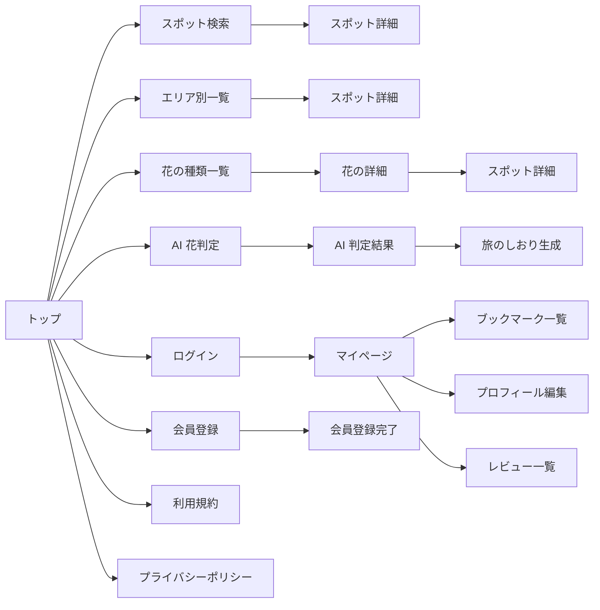
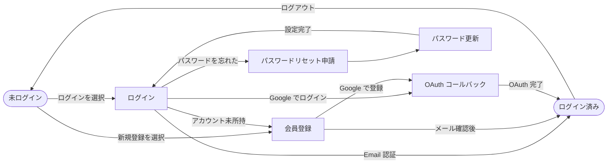
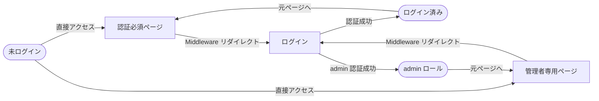
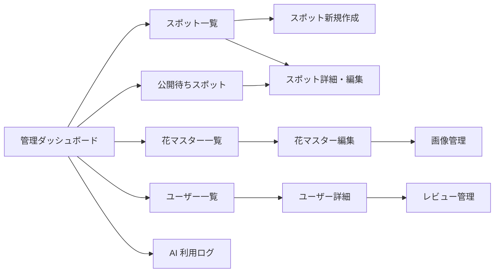

# 02. 画面遷移図

| 項目       | 値                                |
| ---------- | --------------------------------- |
| 参照 spec  | `docs/specs/pages.md`             |
| 関連タスク | T01 要件定義サマリ / T03 画面一覧 |

---

## 1. 主要画面一覧（15 画面）

| #   | 画面 ID | 画面名             | URL                      | 認証要否   |
| --- | ------- | ------------------ | ------------------------ | ---------- |
| 1   | SC-01   | トップ             | `/`                      | 公開       |
| 2   | SC-02   | スポット検索       | `/spots`                 | 公開       |
| 3   | SC-03   | スポット詳細       | `/spots/[id]`            | 公開       |
| 4   | SC-04   | エリア別一覧       | `/areas/[prefecture_id]` | 公開       |
| 5   | SC-05   | 花の種類一覧       | `/flowers`               | 公開       |
| 6   | SC-06   | 花の詳細           | `/flowers/[id]`          | 公開       |
| 7   | SC-07   | AI 花判定          | `/identify`              | 公開       |
| 8   | SC-08   | AI 判定結果        | `/identify/result`       | 公開       |
| 9   | SC-09   | 旅のしおり生成     | `/identify/story`        | 公開       |
| 10  | SC-10   | ログイン           | `/auth/login`            | 公開       |
| 11  | SC-11   | 会員登録           | `/auth/signup`           | 公開       |
| 12  | SC-12   | マイページ         | `/mypage`                | 認証必須   |
| 13  | SC-13   | ブックマーク一覧   | `/mypage/bookmarks`      | 認証必須   |
| 14  | SC-14   | プロフィール編集   | `/mypage/profile`        | 認証必須   |
| 15  | SC-15   | 管理ダッシュボード | `/admin`                 | 管理者のみ |

### 認証ページ（主要 15 画面外）

| 画面名                 | URL                       | 認証要否 |
| ---------------------- | ------------------------- | -------- |
| パスワードリセット申請 | `/auth/reset-password`    | 公開     |
| パスワード更新         | `/auth/update-password`   | 公開     |
| OAuth コールバック     | `/auth/callback`（Route） | -        |

### 管理者サブページ（主要 15 画面外）

| 画面名               | URL                    | 認証要否   |
| -------------------- | ---------------------- | ---------- |
| スポット一覧         | `/admin/spots`         | 管理者のみ |
| スポット新規作成     | `/admin/spots/new`     | 管理者のみ |
| 公開待ちスポット     | `/admin/spots/pending` | 管理者のみ |
| スポット詳細・編集   | `/admin/spots/[id]`    | 管理者のみ |
| 花マスター管理       | `/admin/flowers`       | 管理者のみ |
| 花マスター詳細・編集 | `/admin/flowers/[id]`  | 管理者のみ |
| ユーザー管理         | `/admin/users`         | 管理者のみ |
| ユーザー詳細         | `/admin/users/[id]`    | 管理者のみ |
| レビュー管理         | `/admin/reviews`       | 管理者のみ |
| AI 利用ログ          | `/admin/ai-usage`      | 管理者のみ |
| 画像管理             | `/admin/images`        | 管理者のみ |

---

## 2. 画面遷移図

### 2-1. 全体フロー（ユーザー向け）

トップを起点に各ユーザー導線が左→右に伸びるレイアウト。

### 2-2. 認証フロー

### 2-3. 認証必須ページのリダイレクト

### 2-4. 管理者フロー

---

## 3. 認証要否サマリ

| 区分           | 対象 URL                                                                 | 未ログイン時の挙動                           |
| -------------- | ------------------------------------------------------------------------ | -------------------------------------------- |
| 公開           | `/` `/spots/*` `/areas/*` `/flowers/*` `/identify/*` `/terms` `/privacy` | そのまま表示                                 |
| 認証必須       | `/mypage/*`                                                              | `/auth/login` へリダイレクト                 |
| 管理者のみ     | `/admin/*`                                                               | `/auth/login` へリダイレクト                 |
| 認証ページ自体 | `/auth/*`                                                                | ログイン済みならトップへリダイレクト（任意） |

保護の実装は Next.js Middleware（`middleware.ts`）で `supabase.auth.getUser()` を呼び、パス別にリダイレクトを分岐する。管理者判定は `profiles.role = 'admin'` で行う。

---

## 4. 主要動線の完了確認

| 動線                                 | 対応する遷移（ダイアグラム番号）     |
| ------------------------------------ | ------------------------------------ |
| TOP → 検索 → 詳細                    | 2-1（TOP→SC-02→SC-03）               |
| TOP → エリア → 詳細                  | 2-1（TOP→SC-04→SC-03）               |
| TOP → 花一覧 → 花詳細 → スポット詳細 | 2-1（TOP→SC-05→SC-06→SC-03）         |
| スポット詳細 → AI 判定 → 結果        | 2-1（SC-03→SC-07→SC-08）             |
| AI 判定 → しおり生成 → SNS シェア    | 2-1（SC-07→SC-08→SC-09）             |
| 未ログイン → ログイン → マイページ   | 2-2 + 2-3                            |
| スポット詳細 → ブックマーク          | 2-3（SC-03→SC-13）                   |
| 管理者：公開待ちスポットを公開       | 2-5（SPOTS_PENDING→SPOTS_EDIT→公開） |

---

## 5. 参考

- `docs/specs/pages.md` — ページ構成・URL 設計・認証ルールの定義元
- `docs/specs/supabase-auth.md` — Middleware の認証実装詳細
- `docs/design-docs/01_requirements.md` — F-01〜F-12 と主要ユーザー導線
