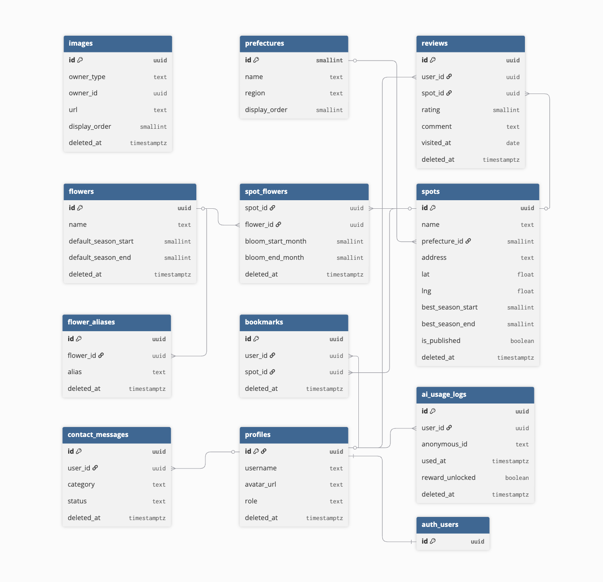

# 05. ER 図

| 項目       | 値                               |
| ---------- | -------------------------------- |
| 参照 spec  | `docs/specs/database.md`         |
| 関連タスク | T04 API 一覧 / T06 外部 I/F 設計 |

---

## 1. ER 図

`created_at` / `updated_at` は全テーブル共通のため省略（§2 テーブル一覧を参照）。

> `images` テーブルは `owner_type`（`'spot'` / `'flower'`）+ `owner_id` による多態関連のため外部キー制約なし（図中は孤立表示）。

---

## 2. テーブル一覧

| #   | テーブル名         | 区分             | RLS | 論理削除 | 概要                                             |
| --- | ------------------ | ---------------- | --- | -------- | ------------------------------------------------ |
| 1   | `prefectures`      | マスター（固定） | ×   | ×        | 都道府県 47 件。アプリからは変更しない           |
| 2   | `profiles`         | ユーザー         | ○   | ○        | `auth.users` と 1:1。`role` で管理者判定         |
| 3   | `spots`            | コンテンツ       | ○   | ○        | 花畑スポット。`is_published` で公開管理          |
| 4   | `flowers`          | マスター         | ○   | ○        | 花の総称。AI 判定のマッチング基準                |
| 5   | `flower_aliases`   | マスター         | ○   | ○        | 品種名・表記揺れ。AI 判定 3 段階マッチング用     |
| 6   | `spot_flowers`     | 中間テーブル     | ○   | ○        | スポット × 花の M:N。スポット固有の開花月保持    |
| 7   | `images`           | コンテンツ       | ○   | ○        | 多態関連。`owner_type`+`owner_id` で親を識別     |
| 8   | `bookmarks`        | ユーザー行動     | ○   | ○        | 1 ユーザー × 1 スポットで UNIQUE 制約            |
| 9   | `reviews`          | ユーザー行動     | ○   | ○        | 1 ユーザー × 1 スポットで UNIQUE 制約。星 + 一言 |
| 10  | `ai_usage_logs`    | ログ             | ○   | ○        | 匿名（`anonymous_id`）/ ログイン両対応           |
| 11  | `contact_messages` | 運用             | ○   | ○        | お問い合わせ受信箱。管理者のみ閲覧               |

---

## 3. 主要な関連性

### 3-1. スポット × 花（M:N）

`spot_flowers` が中間テーブル。スポット固有の開花時期（`bloom_start_month` / `bloom_end_month`）を保持し、`flowers.default_season_*` のフォールバックと組み合わせて見頃カレンダーを構成する。

| 優先度 | カラム                       | 用途                                 |
| ------ | ---------------------------- | ------------------------------------ |
| 高     | `spot_flowers.bloom_*_month` | スポット固有の開花時期（最も正確）   |
| 低     | `flowers.default_season_*`   | フォールバック（上記が NULL の場合） |

### 3-2. images の多態関連

`images` は `spots` と `flowers` の両方の画像を一元管理する。外部キー制約を持てないため整合性を 2 層で保証する。

| 層             | 実装                                                                                 |
| -------------- | ------------------------------------------------------------------------------------ |
| A 層（アプリ） | `lib/utils/imageValidator.ts` の `validateImageOwner()` で INSERT 前に親存在チェック |
| B 層（DB）     | `validate_image_owner_trigger` で INSERT / UPDATE 時に親存在をチェック               |

取得時は Supabase の relation join（`select: '*, images(*)'`）では取れない。必ず別クエリで `eq('owner_type', ...)` + `eq('owner_id', ...)` + `is('deleted_at', null)` + `order('display_order')` を組み合わせること。

### 3-3. 匿名ユーザー対応

`ai_usage_logs` と `contact_messages` は `user_id` が NULL でも許容する（匿名ユーザーも利用可能）。

- `ai_usage_logs`: 匿名は `anonymous_id`（localStorage の UUID）でレート制限を管理
- `contact_messages`: 匿名ユーザーはメールアドレスで本人特定

---

## 4. 論理削除サマリ

`prefectures` を除く全テーブルに `deleted_at TIMESTAMPTZ DEFAULT NULL` を持たせる。

| ルール                 | 詳細                                                                                  |
| ---------------------- | ------------------------------------------------------------------------------------- |
| 全クエリでフィルタ必須 | `.is('deleted_at', null)`（Supabase クライアント）/ `WHERE deleted_at IS NULL`（SQL） |
| RLS SELECT に含めない  | 論理削除 UPDATE の RETURNING が SELECT ポリシーに引っかかるため                       |
| カスケード論理削除     | `spots` 削除 → `images(spot用)` を自動論理削除（DB トリガー）                         |
|                        | `flowers` 削除 → `images(flower用)` を自動論理削除（DB トリガー）                     |
| 退会後レビューの扱い   | `profiles.deleted_at IS NOT NULL` の場合に「退会済ユーザー」と表示（物理削除しない）  |

---

## 5. 参考

- `docs/specs/database.md` — テーブル定義・RLS・トリガー・インデックスの定義元
- `docs/design-docs/04_api-list.md` — Route Handler / Server Action との対応
- `lib/utils/imageValidator.ts` — 多態関連の A 層検証実装
- `lib/utils/seasonUtils.ts` — 月またぎ見頃判定ロジック
