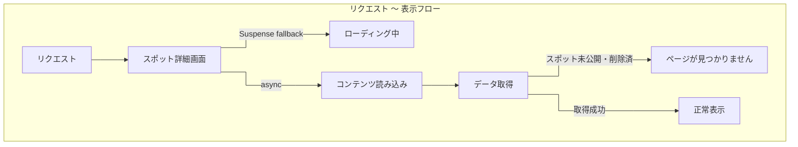

# 07. 詳細設計サンプル — スポット詳細画面

| 項目         | 値                                                                                             |
| ------------ | ---------------------------------------------------------------------------------------------- |
| 参照 spec    | `docs/specs/database.md` / `docs/specs/pages.md` / `docs/specs/seo.md`                         |
| 関連タスク   | T04 API 一覧 / T05 ER 図 / T06 外部 I/F 設計                                                   |
| 実装ファイル | `app/(site)/spots/[id]/page.tsx` / `lib/queries/spotDetail.ts` / `app/api/spots/[id]/route.ts` |

---

## 1. 画面概要

| 項目      | 値                                                                  |
| --------- | ------------------------------------------------------------------- |
| URL       | `/spots/[id]`                                                       |
| 認証      | 公開（未ログインでも閲覧可）                                        |
| Component | Server Component（外枠）+ Suspense 内 `SpotDetailContent`（Server） |
| Loading   | `<SpotDetailSkeleton>` — パルスアニメーションのスケルトン           |

---

## 2. データモデル定義

### 2-1. SpotDetail（スポット本体）

`lib/queries/spotDetail.ts` の `SpotDetail` 型に対応。

| フィールド         | 型               | 必須 | 説明・取得方法                                                   |
| ------------------ | ---------------- | ---- | ---------------------------------------------------------------- |
| `id`               | `string (UUID)`  | ✅   | `spots.id`                                                       |
| `name`             | `string`         | ✅   | `spots.name`                                                     |
| `nameKana`         | `string \| null` | —    | `spots.name_kana`                                                |
| `description`      | `string \| null` | —    | `spots.description`                                              |
| `prefectureId`     | `number`         | ✅   | `spots.prefecture_id`                                            |
| `prefectureName`   | `string`         | ✅   | `prefectures.name`（join）                                       |
| `prefectureRegion` | `string`         | ✅   | `prefectures.region`（join）                                     |
| `location`         | `string`         | ✅   | `spots.location`（住所テキスト）                                 |
| `latitude`         | `number \| null` | —    | `spots_latitude()` computed column（PostGIS GEOGRAPHY から変換） |
| `longitude`        | `number \| null` | —    | `spots_longitude()` computed column（同上）                      |
| `officialUrl`      | `string \| null` | —    | `spots.official_url`                                             |
| `accessInfo`       | `string \| null` | —    | `spots.access_info`                                              |
| `parkingInfo`      | `string \| null` | —    | `spots.parking_info`                                             |
| `entranceFee`      | `string \| null` | —    | `spots.entrance_fee`                                             |
| `bestSeasonStart`  | `number (1-12)`  | ✅   | `spots.best_season_start`                                        |
| `bestSeasonEnd`    | `number (1-12)`  | ✅   | `spots.best_season_end`                                          |
| `source`           | `string \| null` | —    | `spots.source`（`officialUrl` が null の場合は DB 制約上必須）   |
| `updatedAt`        | `string (ISO)`   | ✅   | `spots.updated_at`                                               |

> `latitude` / `longitude` は `coordinates` (GEOGRAPHY) から computed column で取り出す。`null` の場合は地図・経路ボタンを非表示にし、住所カードのみ表示する。

### 2-2. SpotImage（画像）

| フィールド     | 型               | 必須 | 説明                                 |
| -------------- | ---------------- | ---- | ------------------------------------ |
| `id`           | `string (UUID)`  | ✅   | `images.id`                          |
| `url`          | `string`         | ✅   | Supabase Storage 公開 URL            |
| `caption`      | `string \| null` | —    | `images.caption`。`alt` に使用       |
| `displayOrder` | `number`         | ✅   | `images.display_order`（昇順で表示） |

取得条件: `owner_type='spot'` かつ `owner_id=spot.id` かつ `deleted_at IS NULL`、`display_order` 昇順。

### 2-3. SpotFlowerEntry（見られる花）

| フィールド           | 型               | 必須 | 説明                                               |
| -------------------- | ---------------- | ---- | -------------------------------------------------- |
| `flowerId`           | `string (UUID)`  | ✅   | `flowers.id`                                       |
| `flowerName`         | `string`         | ✅   | `flowers.name`                                     |
| `defaultSeasonStart` | `number \| null` | —    | `flowers.default_season_start`（フォールバック用） |
| `defaultSeasonEnd`   | `number \| null` | —    | `flowers.default_season_end`（フォールバック用）   |
| `bloomStartMonth`    | `number \| null` | —    | `spot_flowers.bloom_start_month`（スポット固有）   |
| `bloomEndMonth`      | `number \| null` | —    | `spot_flowers.bloom_end_month`（スポット固有）     |

見頃表示の優先度: `bloomStartMonth / bloomEndMonth` → `defaultSeasonStart / defaultSeasonEnd` の順でフォールバック（`docs/design-docs/05_er-diagram.md` §3-1 参照）。

### 2-4. SpotReview（レビュー）

| フィールド  | 型                                | 必須 | 説明                                                       |
| ----------- | --------------------------------- | ---- | ---------------------------------------------------------- |
| `id`        | `string (UUID)`                   | ✅   | `reviews.id`                                               |
| `rating`    | `number (1-5)`                    | ✅   | `reviews.rating`                                           |
| `comment`   | `string \| null`                  | —    | `reviews.comment`                                          |
| `visitedAt` | `string (ISO date) \| null`       | —    | `reviews.visited_at`                                       |
| `createdAt` | `string (ISO)`                    | ✅   | `reviews.created_at`（降順ソート）                         |
| `reviewer`  | `{ username, avatarUrl } \| null` | —    | `null` = 退会済みユーザー（UI で「退会済ユーザー」と表示） |

取得は別クエリ 2 本（reviews → `IN` で profiles を手動マージ）。PostgREST の embedded join が `auth.users` を介した FK を解決できないため。上限 50 件。

### 2-5. ReviewSummary（レビュー集計）

| フィールド | 型               | 説明                                     |
| ---------- | ---------------- | ---------------------------------------- |
| `count`    | `number`         | 論理削除されていないレビュー件数         |
| `average`  | `number \| null` | 評価平均（小数点 1 位、0 件時は `null`） |

### 2-6. RelatedSpot（関連スポット）

| フィールド          | 型                         | 必須 | 説明                                      |
| ------------------- | -------------------------- | ---- | ----------------------------------------- |
| `id`                | `string (UUID)`            | ✅   | `spots.id`                                |
| `name`              | `string`                   | ✅   | `spots.name`                              |
| `prefectureName`    | `string`                   | ✅   | `prefectures.name`（join）                |
| `bestSeasonStart`   | `number (1-12)`            | ✅   | `spots.best_season_start`                 |
| `bestSeasonEnd`     | `number (1-12)`            | ✅   | `spots.best_season_end`                   |
| `coverImageUrl`     | `string \| null`           | —    | `images.url`（display_order 最小の 1 枚） |
| `coverImageCaption` | `string \| null`           | —    | `images.caption`                          |
| `reason`            | `'prefecture' \| 'flower'` | ✅   | 取得理由（同都道府県 or 同じ花種類）      |

取得戦略: 同都道府県を優先して最大 `limit=4` 件。不足分を同じ `flower_id` を持つスポットで補完。

---

## 3. 表示セクション定義

| #   | セクション                                      | コンポーネント / 要素                       | 表示条件                                            |
| --- | ----------------------------------------------- | ------------------------------------------- | --------------------------------------------------- |
| 1   | パンくず                                        | `<Breadcrumb>`                              | 常時                                                |
| 2   | 地方 / 都道府県 ラベル                          | `
` テキスト                              | 常時                                                |
| 3   | スポット名 + ブックマークボタン                 | `<h1>` + `<BookmarkButtonIsland>`（Client） | 常時                                                |
| 4   | ふりがな                                        | `
`                                       | `nameKana` が存在する場合のみ                       |
| 5   | 見頃バッジ + 今が見頃ラベル                     | `` × 2                                | 常時（見頃バッジ）/ `isInBestSeason()=true` で後者  |
| 6   | 花タグ（最大 3 件）                             | `<Link>` チップ → `/flowers/[id]`           | `flowers.length > 0` の場合                         |
| 7   | 画像ギャラリー                                  | `<SpotImageGallery>`（Client）              | 常時（0 件時はくすみピンクのプレースホルダー）      |
| 8   | 概要テキスト                                    | `
`                                       | `description` が存在する場合のみ                    |
| 9   | 情報カード（住所 / アクセス / 駐車場 / 入場料） | `<InfoCard>` × 1〜4                         | 住所は常時。その他は各フィールドが存在する場合のみ  |
| 10  | 地図ピン                                        | `<SpotMapPin>`（Client / Google Maps）      | `latitude` / `longitude` が存在する場合のみ         |
| 11  | 経路を調べるボタン                              | `<a>` → Google Maps directions / 住所検索   | 常時（lat-lng あれば directions、なければ住所検索） |
| 12  | 見られる花一覧                                  | `<SpotFlowersList>`                         | 常時（0 件時は空状態メッセージ）                    |
| 13  | マナー啓発文言                                  | `<MannerNotice>`                            | 常時                                                |
| 14  | 公式サイト / 出典クレジット                     | `<section>` テキスト + `<Link>`             | `officialUrl` または `source` が存在する場合のみ    |
| 15  | レビューセクション                              | `<SpotReviewBlockIsland>`（Client）         | 常時（0 件時は空状態 + 投稿フォームへの動線）       |
| 16  | 近くの宿（楽天トラベル）                        | `<AffiliateHotelSection>`（T22a）           | `latitude` / `longitude` が存在する場合のみ         |
| 17  | 関連スポット                                    | `<RelatedSpots>`                            | `relatedSpots.length > 0` の場合                    |

---

## 4. 画面状態遷移

### 4-1. Not Found 状態

`getSpotDetail()` が `null` を返す条件（いずれか）:

- `spots.id` が存在しない
- `is_published = false`
- `deleted_at IS NOT NULL`

`notFound()` を呼ぶことで `not-found.tsx` を表示する。

### 4-2. 正常状態（部分空状態を含む）

| 条件                                    | 表示                                                       |
| --------------------------------------- | ---------------------------------------------------------- |
| `images.length === 0`                   | くすみピンク系グラデーションのプレースホルダー             |
| `flowers.length === 0`                  | 「関連する花の情報はありません」等の空状態メッセージ       |
| `reviews.length === 0`                  | 「まだレビューがありません」+ レビュー投稿フォームへの動線 |
| `relatedSpots.length === 0`             | 関連スポットセクション自体を非表示                         |
| `latitude === null`                     | 地図・経路ボタンを非表示。住所カードのみ表示               |
| `reviewer === null`（退会済みユーザー） | 「退会済ユーザー」文字列でレビュー投稿者名を代替           |
| `isInBestSeason() = false`              | 「今が見頃」バッジを非表示。見頃バッジ（期間表示）は残す   |

---

## 5. 関連 API

### 5-1. データ取得（Server Component 直接呼び出し）

| 関数 / クエリ       | 用途                                 | 呼び出し元                               |
| ------------------- | ------------------------------------ | ---------------------------------------- |
| `getSpotDetail(id)` | スポット詳細バンドル一式取得         | `loadSpotBundle()` → `SpotDetailContent` |
| `getSpotMeta(id)`   | OGP / `<title>` 用の軽量メタ情報取得 | `generateMetadata()`                     |

### 5-2. ブックマーク（Island パターン）

`<BookmarkButtonIsland>` が `/api/bookmarks/*` を叩く。認証状態はクライアントで `createBrowserClient().auth.getUser()` で確認。

| メソッド | URL                        | 認証 | 説明                                         |
| -------- | -------------------------- | ---- | -------------------------------------------- |
| GET      | `/api/bookmarks/[spot_id]` | 必須 | ブックマーク済みか確認（初期状態取得）       |
| POST     | `/api/bookmarks`           | 必須 | ブックマーク追加（`{ spot_id }` を body に） |
| DELETE   | `/api/bookmarks/[spot_id]` | 必須 | ブックマーク削除（論理削除）                 |

### 5-3. レビュー（Island パターン）

`<SpotReviewBlockIsland>` 内でレビューの投稿・編集・削除を担う。

| メソッド | URL                                 | 認証 | 説明                                          |
| -------- | ----------------------------------- | ---- | --------------------------------------------- |
| GET      | `/api/me/reviews/by-spot/[spot_id]` | 必須 | 自分のレビューを取得（編集フォーム初期値）    |
| POST     | `/api/reviews`                      | 必須 | レビュー投稿（初回 / 論理削除からの復元）     |
| PATCH    | `/api/reviews/[id]`                 | 必須 | レビュー編集（rating / comment / visited_at） |
| DELETE   | `/api/reviews/[id]`                 | 必須 | レビュー論理削除                              |

`?edit=review` の searchParams を受け取ったとき、`editIntent=true` として `SpotReviewBlockIsland` に渡し、フォームを開いた状態で初期表示する。

---

## 6. SEO 設計

### 6-1. `generateMetadata`

| メタタグ           | 値                                                                          |
| ------------------ | --------------------------------------------------------------------------- |
| `title`            | `{spot.name} \| hana nav`                                                   |
| `description`      | 「{name}（{prefectureName}）は見頃 {seasonText} の花畑スポットです。…」形式 |
| `openGraph.type`   | `'article'`                                                                 |
| `openGraph.url`    | `/spots/{id}`                                                               |
| `openGraph.images` | `coverImageUrl` が存在する場合のみ付与                                      |

### 6-2. JSON-LD（構造化データ）

型: `TouristAttraction`

| プロパティ        | 値                                  | 付与条件                         |
| ----------------- | ----------------------------------- | -------------------------------- |
| `@type`           | `TouristAttraction`                 | 常時                             |
| `name`            | `spot.name`                         | 常時                             |
| `description`     | `spot.description`                  | 存在する場合                     |
| `url`             | `{NEXT_PUBLIC_BASE_URL}/spots/{id}` | 常時                             |
| `image`           | `images[0].url`                     | 画像が 1 件以上の場合            |
| `geo`             | `{ latitude, longitude }`           | `latitude !== null` の場合       |
| `aggregateRating` | `{ ratingValue, reviewCount }`      | `reviewSummary.count > 0` の場合 |

---

## 7. キャッシュ設計

| キャッシュタグ | 付与条件         | invalidate する操作                                 |
| -------------- | ---------------- | --------------------------------------------------- |
| `spot:<id>`    | このスポット固有 | スポット編集 / 公開切替 / 論理削除（admin）         |
| `spots`        | 全スポット系     | スポット追加・公開 / 関連スポット表示に影響する操作 |
| `flowers`      | 全花マスター系   | 花マスター編集・削除（見られる花表示に影響）        |

Admin Server Actions（`updateSpotAction` / `togglePublishedAction` 等）が `updateTag()` を呼ぶことで同期的にキャッシュを破棄する（`revalidateTag` の非同期再検証ではなく即時破棄のため `updateTag` を採用）。

---

## 8. 参考

- `docs/specs/database.md` — spots / images / spot_flowers / reviews テーブル定義・computed column
- `docs/specs/pages.md` — URL 設計・認証ルール
- `docs/specs/seo.md` — JSON-LD / OGP 設計
- `docs/specs/operations.md` — マナー啓発・オーバーツーリズム対策
- `docs/design-docs/04_api-list.md` — `/api/spots/[id]` / ブックマーク / レビュー API 一覧
- `docs/design-docs/05_er-diagram.md` — 見頃フォールバック（§3-1）・images 多態関連（§3-2）
- `lib/queries/spotDetail.ts` — データ取得関数の実装
- `lib/utils/seasonUtils.ts` — `isInBestSeason()` / `formatSeasonRange()`
