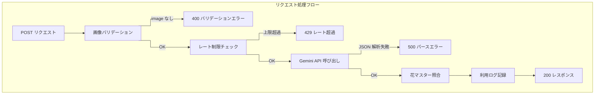

# 08. 詳細設計サンプル — API: AI 花判定

| 項目         | 値                                                |
| ------------ | ------------------------------------------------- |
| 参照 spec    | `docs/specs/ai-identify.md` / `docs/specs/api.md` |
| 関連タスク   | T04 API 一覧 / T09 AI 花判定処理フロー詳細        |
| 実装ファイル | `app/api/ai/identify-flower/route.ts`             |

---

## 1. API 概要

| 項目         | 値                                                                       |
| ------------ | ------------------------------------------------------------------------ |
| メソッド     | `POST`                                                                   |
| URL          | `/api/ai/identify-flower`                                                |
| 認可         | 不要（匿名ユーザーも利用可。レート制限で利用回数を管理）                 |
| Content-Type | `multipart/form-data`                                                    |
| 説明         | 画像を受け取り Gemini API で花を判定。花マスター照合・関連スポットを返す |

---

## 2. リクエスト定義

### 2-1. リクエストボディ（FormData）

| フィールド | 型               | 必須 | 説明                                                                     |
| ---------- | ---------------- | ---- | ------------------------------------------------------------------------ |
| `image`    | `File`           | ✅   | 判定対象画像。クライアント側で max-width 1024px / 2MB 以下にリサイズ済み |
| `userId`   | `string \| null` | —    | ログイン中ユーザーの UUID。未ログインの場合は `null`                     |
| `anonId`   | `string`         | ✅   | 匿名 ID（`localStorage` に保存した UUID）。ログイン中も送信する          |

> `userId` と `anonId` はレート制限の判定に使用する。ログイン中は `userId` 優先、未ログインは `anonId` のみで判定。

---

## 3. レスポンス定義

### 3-1. 成功時（HTTP 200）

```json
{
  "success": true,
  "ai_result": { ... },
  "flower_master": { ... } | null,
  "flower_images": [ ... ],
  "recommended_spots": [ ... ],
  "rate_limit": { ... }
}
```

#### `ai_result`（Gemini API の返却値）

| フィールド            | 型        | 説明                                                        |
| --------------------- | --------- | ----------------------------------------------------------- |
| `flower_name`         | `string`  | 総称（マッチング用。例：「桜」）                            |
| `flower_variety`      | `string`  | 品種名（表示用。例：「ソメイヨシノ」）                      |
| `confidence`          | `number`  | 判定信頼度（0.0〜1.0）                                      |
| `bloom_status`        | `string`  | 開花状況。`"つぼみ"` / `"見頃"` / `"終わりかけ"` のいずれか |
| `description`         | `string`  | 花の特徴（120 文字以内）                                    |
| `flower_language`     | `string`  | 花言葉（2〜3 個）                                           |
| `fun_fact`            | `string`  | 豆知識（100 文字以内）                                      |
| `best_viewing_months` | `string`  | 一般的な開花時期（例：`"4月〜5月"`）                        |
| `is_flower`           | `boolean` | 花以外の画像の場合 `false`                                  |

#### `flower_master`（花マスター照合結果）

3 段階フォールバックマッチングで `flowers` テーブルと照合した結果。マッチしなかった場合は `null`。

| フィールド             | 型               | 説明                 |
| ---------------------- | ---------------- | -------------------- |
| `id`                   | `string (UUID)`  | `flowers.id`         |
| `name`                 | `string`         | `flowers.name`       |
| `default_season_start` | `number \| null` | デフォルト開花開始月 |
| `default_season_end`   | `number \| null` | デフォルト開花終了月 |

#### `flower_images`（花マスター画像）

`flower_master` が `null` のときは空配列。

| フィールド      | 型               | 説明                      |
| --------------- | ---------------- | ------------------------- |
| `id`            | `string (UUID)`  | `images.id`               |
| `url`           | `string`         | Supabase Storage 公開 URL |
| `caption`       | `string \| null` | `images.caption`          |
| `display_order` | `number`         | 昇順で取得                |

#### `recommended_spots`（関連スポット、最大 5 件）

`flower_master` が `null` のときは空配列。

| フィールド          | 型               | 説明                                           |
| ------------------- | ---------------- | ---------------------------------------------- |
| `id`                | `string (UUID)`  | `spots.id`                                     |
| `name`              | `string`         | `spots.name`                                   |
| `location`          | `string`         | `spots.location`（住所テキスト）               |
| `official_url`      | `string \| null` | `spots.official_url`                           |
| `best_season_start` | `number`         | `spots.best_season_start`                      |
| `best_season_end`   | `number`         | `spots.best_season_end`                        |
| `prefecture`        | `object`         | `{ id, name, region }`                         |
| `cover_image`       | `string \| null` | `display_order=0` の画像 URL（別クエリで取得） |

#### `rate_limit`

| フィールド  | 型       | 説明                           |
| ----------- | -------- | ------------------------------ |
| `remaining` | `number` | 今回の判定消費後の残回数       |
| `limit`     | `number` | 本日の上限回数（報酬込みの値） |

---

## 4. エラーレスポンス

| HTTP | `error` 値                       | 発生条件                                          |
| ---- | -------------------------------- | ------------------------------------------------- |
| 400  | `"image is required"`            | `image` フィールドが FormData に含まれていない    |
| 429  | `"rate_limit_exceeded"`          | 本日のレート上限に達した                          |
| 500  | `"AI response parse failed"`     | Gemini API のレスポンスが JSON として解析できない |
| 500  | `"サーバーエラーが発生しました"` | その他の予期しないエラー                          |

### 429 レスポンス詳細

```json
{
  "error": "rate_limit_exceeded",
  "message": "本日のAI判定回数の上限に達しました",
  "remaining": 0,
  "showAdReward": true
}
```

`showAdReward: true` のとき、クライアントは広告視聴による追加回数付与 UI を表示する。

---

## 5. 認可・レート制限

### 5-1. 認可

認証不要。ただし `anonId`（`localStorage` UUID）は必須。

### 5-2. レート制限ロジック

| ユーザー種別 | 基本上限 | 判定キー |
| ------------ | -------- | -------- |
| 未ログイン   | 1/日     | `anonId` |
| ログイン済み | 3/日     | `userId` |

広告視聴報酬（`reward_unlocked = true`）が付与されるたびに上限 +5 回加算される。

```
本日の上限 = 基本上限 + (reward_unlocked な行数) × 5
```

判定は `ai_usage_logs` テーブルの当日レコード件数でカウントする（`used_at >= 本日 00:00:00` かつ `deleted_at IS NULL`）。

---

## 6. 処理フロー



### 6-1. 花マスター照合（3 段階フォールバック）

| 優先度 | 照合対象               | 照合キー         |
| ------ | ---------------------- | ---------------- |
| 1      | `flowers.name`         | `flower_name`    |
| 2      | `flower_aliases.alias` | `flower_name`    |
| 3      | `flower_aliases.alias` | `flower_variety` |

いずれにもマッチしない場合、`flower_master: null` として返す（AI 判定結果 `ai_result` は返す）。

---

## 7. 参考

- `docs/specs/ai-identify.md` — Gemini API 呼び出し・3 段階フォールバック・UI レイアウト
- `docs/specs/api.md` — Route Handler 一覧
- `docs/design-docs/04_api-list.md` — API 一覧（§1-5）
- `docs/design-docs/09_ai-flow.md` — 処理フロー詳細（T09）
- `docs/specs/database.md` — `ai_usage_logs` テーブル定義
