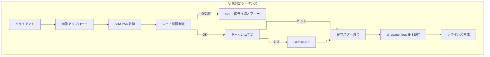

# 09. AI 花判定処理フロー詳細

| 項目         | 値                                                                                  |
| ------------ | ----------------------------------------------------------------------------------- |
| 参照 spec    | `docs/specs/ai-identify.md` / `docs/specs/operations.md` / `docs/specs/database.md` |
| 関連タスク   | T06 外部 I/F 設計 / T08 API 詳細設計（AI 花判定）                                   |
| 実装ファイル | `app/api/ai/identify-flower/route.ts`                                               |

---

## 1. 処理概要

`POST /api/ai/identify-flower` の内部処理を 5 フェーズに分割する。それぞれが独立した目的（コスト削減 / 悪用防止 / マッチング成功率）を持つ。

| #   | フェーズ            | 目的                                                                   |
| --- | ------------------- | ---------------------------------------------------------------------- |
| 1   | 画像前処理          | Gemini 呼び出し前に画像サイズを削減し、キャッシュキーを計算            |
| 2   | レート制限判定      | 匿名 1/日・ログイン 3/日の上限を DB カウントで判定                     |
| 3   | キャッシュ判定      | SHA-256 一致でヒットすれば Gemini を呼ばず結果を再利用                 |
| 4   | Gemini API 呼び出し | 画像 + プロンプトを送信し JSON レスポンスを取得                        |
| 5   | 花マスター照合      | 3 段階フォールバックで `flowers` に紐付け、関連スポットを最大 5 件取得 |

---

## 2. 画像前処理

### 2-1. クライアント側リサイズ

判定精度と Gemini API コストのバランスから、送信前に画像を圧縮する。

| パラメータ | 値            | 理由                                                                |
| ---------- | ------------- | ------------------------------------------------------------------- |
| 最大幅     | 1024px        | Gemini の判定精度が飽和する解像度。これ以上大きくても精度差が出ない |
| 形式       | JPEG 品質 0.8 | PNG より 5〜10 倍軽く、可視的な劣化がない                           |
| 上限サイズ | 2MB           | Gemini API のリクエスト上限（4MB）に対し安全マージン                |

リサイズは Canvas API で実施し、`FormData` に載せて送信する。サーバーは追加のリサイズを行わない（クライアントが破ってきたケースは Content-Length で 400 を返す前提）。

### 2-2. サーバー側 SHA-256 ハッシュ

Route Handler は `image` フィールドを `ArrayBuffer` として受け取り、`crypto.subtle.digest('SHA-256', buffer)` で 32 byte のハッシュを計算し、hex 文字列（64 文字）に変換してキャッシュキーとする。

| 項目           | 値                                             |
| -------------- | ---------------------------------------------- |
| 実装           | Node.js 標準の `crypto.subtle`（外部依存なし） |
| 計算対象       | クライアント送信後の Buffer 全体               |
| 出力           | hex 文字列（64 文字）                          |
| キャッシュ用途 | §3 の `unstable_cache` キー                    |

同じ画像を再アップロードしても Buffer が完全一致すればハッシュも一致するため、キャッシュヒットする。クライアント側で再撮影・再エンコードした場合は別ハッシュになる（許容）。

---

## 3. キャッシュ戦略

### 3-1. 目的

Gemini API の課金は 1 リクエスト = 1 課金。SNS でバズって同一画像が繰り返し送信されるケース（例: サンプル画像を共有）で、**重複呼び出しをゼロ化** することがコスト管理の主目的。

### 3-2. キャッシュする対象

| 項目                | キャッシュする？ | 理由                                                         |
| ------------------- | ---------------- | ------------------------------------------------------------ |
| `ai_result`         | ✅ する          | Gemini API の呼び出し結果。画像が同じなら結果も同じ          |
| `flower_master`     | ❌ しない        | DB の花マスターは admin が更新するため、常に最新を照合したい |
| `flower_images`     | ❌ しない        | 同上                                                         |
| `recommended_spots` | ❌ しない        | 公開スポットは admin が随時追加・非公開化する                |
| `rate_limit`        | ❌ しない        | ユーザー固有・時点依存                                       |

つまり **Gemini API の呼び出しだけをキャッシュ**し、DB 照合はキャッシュヒット時も毎回実行する。これにより「花マスターが新しく追加されたのに古い判定結果で `flower_master: null` を返す」事故を防ぐ。

### 3-3. 実装方針

Next.js 16 の `'use cache'` ディレクティブを使い、ハッシュを引数に取るヘルパー関数に閉じ込める。

```typescript
async function callGeminiCached(imageHash: string, imageBase64: string, mimeType: string) {
  'use cache';
  cacheTag(`ai-identify:${imageHash}`);
  cacheLife({ revalidate: 86400, expire: 86400 }); // 24h
  return callGeminiAPI(imageBase64, mimeType);
}
```

Route Handler 側:

```typescript
const buffer = Buffer.from(await imageFile.arrayBuffer());
const hash = await sha256Hex(buffer);
const base64 = buffer.toString('base64');
const aiResult = await callGeminiCached(hash, base64, imageFile.type);
// 以降、DB 照合は毎回実行
```

### 3-4. ヒット/ミス時の挙動差分

| 状態   | Gemini 呼び出し | DB 照合 | `ai_usage_logs` INSERT | レート消費 |
| ------ | --------------- | ------- | ---------------------- | ---------- |
| ヒット | ❌ なし         | ✅ あり | ✅ あり                | ✅ する    |
| ミス   | ✅ あり         | ✅ あり | ✅ あり                | ✅ する    |

キャッシュヒットしてもレート制限を消費する。理由は「レート制限は API コスト対策ではなく悪用防止（大量投稿抑止）」で、ヒット時もサーバーリソースを消費するため。

### 3-5. TTL 24 時間の根拠

- 花マスターの更新頻度が「日単位」（admin が新規追加）
- 24h を超えると同一画像でも花マスター側の変更が反映されない期間が長くなる
- 24h 未満だとキャッシュヒット率が下がりコスト削減効果が薄い

---

## 4. レート制限アルゴリズム

### 4-1. 判定式

```
基本上限 = ログイン中なら 3、未ログインなら 1
本日の上限 = 基本上限 + (reward_unlocked = true な行数) × 5
本日の消費 = ai_usage_logs の当日行数（deleted_at IS NULL）
allowed   = 本日の消費 < 本日の上限
```

判定は毎リクエストで DB に SQL を発行する（`ai_usage_logs_user_idx` / `ai_usage_logs_anon_idx` のインデックスで高速化済み）。

### 4-2. カウントスコープ

| 種別       | カウントキー   | 集計対象                                            |
| ---------- | -------------- | --------------------------------------------------- |
| 未ログイン | `anonymous_id` | 同 `anonymous_id` の当日 INSERT                     |
| ログイン中 | `user_id`      | 同 `user_id` の当日 INSERT（`anonymous_id` は無視） |

当日判定は「サーバー時刻の `00:00:00` 以降」で行う（`todayStart.setHours(0,0,0,0)`）。タイムゾーンは JST 想定（`TZ=Asia/Tokyo` を Netlify Functions で明示）。

### 4-3. 匿名 ID の生成・永続化

| 項目           | 値                                                                                |
| -------------- | --------------------------------------------------------------------------------- |
| 生成タイミング | AI 判定画面（`/identify`）の初回訪問時                                            |
| 保存先         | `localStorage.getItem('hana-anon-id')`。なければ `crypto.randomUUID()` で新規生成 |
| 削除条件       | 手動削除・ブラウザ Cookie 削除・シークレットモード（回避リスクは許容）            |

---

## 5. 3 段階フォールバックマッチング

### 5-1. アルゴリズム

Gemini は `flower_name`（総称）と `flower_variety`（品種名）の両方を返す。以下の順で `flowers` テーブルにヒットするかを確認する。

| 段階 | 照合対象テーブル       | 照合キー                   | 意図                                                             |
| ---- | ---------------------- | -------------------------- | ---------------------------------------------------------------- |
| 1    | `flowers.name`         | `ai_result.flower_name`    | 総称（例: 「桜」）が花マスター名と完全一致                       |
| 2    | `flower_aliases.alias` | `ai_result.flower_name`    | 総称が別名テーブルに登録されている場合                           |
| 3    | `flower_aliases.alias` | `ai_result.flower_variety` | 総称が取れず品種名（例: 「ソメイヨシノ」）のみ登録されている場合 |

いずれもヒットしない場合は `flower_master = null`、`flower_images = []`、`recommended_spots = []` を返す。`ai_result` は返す（AI 判定の品質確認のため）。

### 5-2. なぜ 3 段階に分けるか

- **1 段階目（総称一致）**: 花マスターは総称単位で管理する方針（例: 「桜」1 レコードに複数品種を紐付け）。ここでヒットすれば理想
- **2 段階目（総称 → alias）**: 表記揺れ吸収。例: マスター名が「桜」でも AI が「サクラ」「cherry blossom」と返した場合、alias 側で拾う
- **3 段階目（品種名 → alias）**: Gemini が総称を返さず品種名だけ返してきたケース（例: 「ソメイヨシノ」のみ）を最後の砦として拾う

段階を増やすとマッチング成功率は上がるが、誤マッチ（違う花を紐付け）のリスクも上がる。3 段階が「常識的な表記揺れ + 品種名補足」の実務的な落とし所。

### 5-3. 実装上の注意

- 各段階で `.is('deleted_at', null)` を必須（マスター論理削除への追従）
- `.maybeSingle()` を使う（`.single()` は 0 件で例外を投げる）
- 2 段階目 → 3 段階目の分岐は `if (!aliasMatch && ai_result.flower_variety)` で判定

---

## 6. 全体シーケンス



---

## 7. 参考

- `docs/specs/ai-identify.md` — 現行実装のプロンプト・レスポンスパース
- `docs/specs/operations.md` — コスト管理（レート制限・キャッシュ・予算アラート）
- `docs/specs/database.md` — `ai_usage_logs` / `flowers` / `flower_aliases` テーブル定義
- `docs/design-docs/06_external-interfaces.md` — Gemini API の呼び出し条件・失敗時挙動
- `docs/design-docs/08_detail-api-ai-identify.md` — API のリクエスト/レスポンス定義（T08）
